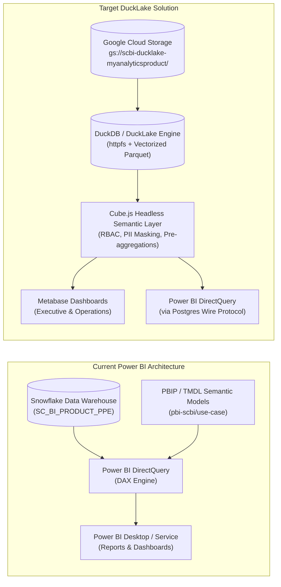
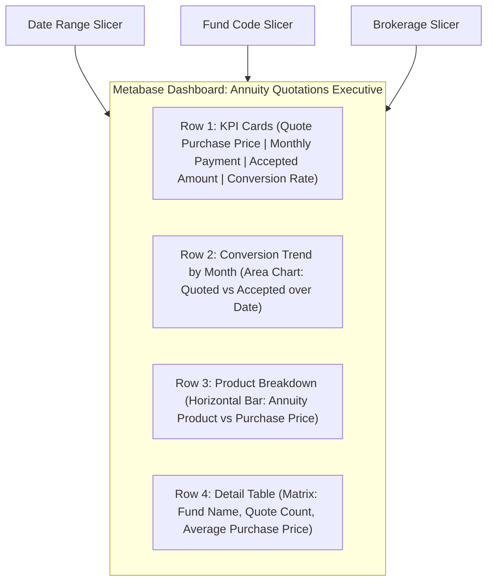
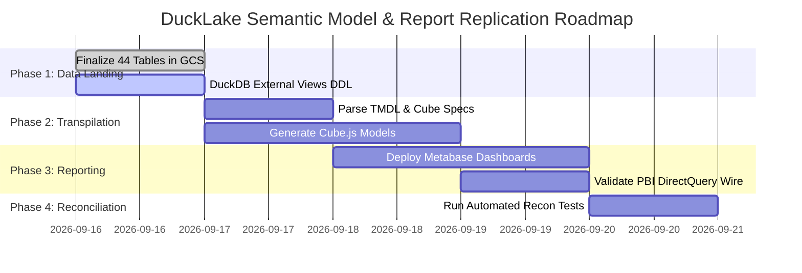

# End-to-End Implementation Guide: Replicating `pbi-scbi` Semantic Models & Power BI Reports in DuckLake, DuckDB & Google Cloud

---

## Executive Summary & Architecture Topology

This guide provides the complete engineering blueprint to read, parse, transpile, and replicate the SAP HANA-migrated Power BI semantic models and reports located in `pbi-scbi` into a **DuckLake, DuckDB, Cube.js, and Google Cloud Storage (GCS)** lakehouse solution.

### Architecture Comparison



---

## 1. Deconstructing the `pbi-scbi` Source Assets

The `pbi-scbi` repository contains three distinct, structured layers of metadata:

| Layer | File Pattern | Content & Value |
|---|---|---|
| **1. Markdown Cube Specs** | `semantic_models/cubes/<slug>.md` | Defines central facts, conformed dimension mappings, role-playing relationships (`FUND_HK` vs `QUOTED_FUND_HK`), grain, and explicit HANA &rarr; DAX measure definitions. |
| **2. Markdown Report Specs** | `semantic_models/cubes/<slug>_report.md` | Defines report visual layout: card metrics, breakdown matrices, slicers, axes, tooltips, and page structures. |
| **3. TMDL Semantic Model Specs** | `semantic_models/use-case/<Name>/<Name>.SemanticModel/definition/` | Microsoft Fabric / PBIP **Tabular Model Definition Language (TMDL)**: `model.tmdl`, `relationships.tmdl`, `tables/*.tmdl`. Contains explicit DAX expressions, format strings, calculated columns, and relationship cardinality. |
| **4. PBIP Report Visuals** | `semantic_models/use-case/<Name>/<Name>.Report/definition/` | JSON visual containers, page sizes, visual bindings, and conditional formatting rules. |

---

## 2. Technical Mapping: Power BI (TMDL/DAX) &rarr; DuckLake (Cube.js/DuckDB)

### 2.1 Relationship & Role-Playing Mapping

In `pbi-scbi`, relationships are defined in `relationships.tmdl`:
```tmdl
relationship 0e123abc-4567-89de-f012-3456789abcde
    fromColumn: CNF__FACT_ANNUITY_QUOTATIONS.FUND_HK
    toColumn: CNF__DIM_FUND.FUND_HK

relationship 1f234bcd-5678-90ef-a123-456789abcdef
    isActive: false
    fromColumn: CNF__FACT_ANNUITY_QUOTATIONS.QUOTED_FUND_HK
    toColumn: CNF__DIM_FUND.FUND_HK
```

**Target Cube.js Mapping (`data-recon/cube/model/cubes/AnnuityQuotation.js`)**:
```javascript
cube(`AnnuityQuotation`, {
  sql: `SELECT * FROM scbi_cdp_mart.cnf__fact_annuity_quotations`,

  joins: {
    // Active relationship
    DimFund: {
      sql: `${CUBE}.FUND_HK = ${DimFund}.FUND_HK`,
      relationship: `manyToOne`
    },
    // Role-playing inactive relationship represented as a distinct join alias
    DimQuotedFund: {
      sql: `${CUBE}.QUOTED_FUND_HK = ${DimQuotedFund}.FUND_HK`,
      relationship: `manyToOne`
    },
    DimDate: {
      sql: `${CUBE}.DATE_SK = ${DimDate}.DATE_SK`,
      relationship: `manyToOne`
    }
  }
});
```

---

### 2.2 DAX to DuckDB / Cube.js Measure Rosetta Stone

| Power BI DAX Expression | DuckDB SQL Equivalent | Cube.js Measure Definition |
|---|---|---|
| `SUM(Table[Col])` | `SUM(col)` | `sum: { sql: `${CUBE}.COL`, type: `sum`, format: `currency` }` |
| `DISTINCTCOUNT(Table[Col])` | `COUNT(DISTINCT col)` | `count: { sql: `${CUBE}.COL`, type: `countDistinct` }` |
| `DIVIDE(N, D, 0)` | `COALESCE(N / NULLIF(D, 0), 0)` | `ratio: { sql: `COALESCE(${num} / NULLIF(${den}, 0), 0)`, type: `number` }` |
| `CALCULATE(SUM(Col), Status = "Accepted")` | `SUM(CASE WHEN status = 'Accepted' THEN col ELSE 0 END)` | `acceptedAmount: { sql: `${CUBE}.COL`, type: `sum`, filters: [{ sql: `${CUBE}.STATUS = 'Accepted'` }] }` |
| `TOTALYTD([Quote Amount], DIM_DATE[DATE_NK])` | `SUM(col) OVER (PARTITION BY calendar_year, member_hk ORDER BY date_sk)` | `ytdAmount: { sql: `${quoteAmount}`, type: `sum`, rollingWindow: { trailing: `1 year`, offset: `end` } }` |

---

## 3. Automated Model Transpiler (`pbi_to_ducklake_transpiler.py`)

To eliminate manual coding across all 12 cubes, implement a Python transpiler in `data-recon/scripts/pbi_to_ducklake_transpiler.py`.

```python
"""
pbi_to_ducklake_transpiler.py

Automated engine that parses TMDL files and Markdown cube specs from pbi-scbi
and generates:
  1. DuckDB View DDLs reading directly from GCS Parquet
  2. Cube.js Semantic Schema files (*.js)
  3. Metabase Collection & Dashboard JSON configurations
"""

import os
import re
import json
from pathlib import Path

PBI_ROOT = Path(r"C:\Users\G988557\Documents\Code\github_DBT\pbi-scbi")
CUBES_DIR = PBI_ROOT / "semantic_models" / "cubes"
USE_CASE_DIR = PBI_ROOT / "semantic_models" / "use-case"
TARGET_CUBEJS_DIR = Path(r"C:\Users\G988557\Documents\Code\github_DBT\data-recon\cube\model\cubes")
TARGET_DUCKDB_VIEWS = Path(r"C:\Users\G988557\Documents\Code\github_DBT\data-recon\scripts\views")

def parse_tmdl_table(table_path):
    """Parses a TMDL table file and extracts measures, columns, and data types."""
    with open(table_path, "r", encoding="utf-8") as f:
        content = f.read()

    table_name = re.search(r"table\s+([^\s\n]+)", content).group(1)
    
    # Extract measures
    measures = []
    measure_blocks = re.findall(r"measure\s+'?([^'=]+)'?\s*=\s*([^\n]+(?:\n\s+[^\n]+)*)", content)
    for name, expr in measure_blocks:
        measures.append({
            "name": name.strip(),
            "expression": expr.strip()
        })

    # Extract columns
    columns = re.findall(r"column\s+([^\s\n]+)", content)
    
    return {
        "table": table_name,
        "columns": columns,
        "measures": measures
    }

def generate_duckdb_views(tables, bucket="scbi-ducklake-myanalyticsproduct"):
    """Generates DuckDB external views over GCS Parquet."""
    ddls = []
    for schema, tbl in tables:
        ddl = f"""
CREATE SCHEMA IF NOT EXISTS {schema.lower()};
CREATE OR REPLACE VIEW {schema.lower()}.{tbl.lower()} AS 
SELECT * FROM read_parquet('gs://{bucket}/{schema.lower()}/{tbl.lower()}/*.parquet');
"""
        ddls.append(ddl.strip())
    return "\n\n".join(ddls)
```

---

## 4. Physical & Logical DuckDB Lakehouse Layer

### 4.1 GCS Authentication in DuckDB
In `data-recon/scripts/init_duckdb.sql`:

```sql
-- Install and load cloud storage extensions
INSTALL httpfs;
LOAD httpfs;

-- Configure GCS access
SET s3_endpoint = 'storage.googleapis.com';
SET s3_access_style = 'path';

-- Authenticate using application default credentials (ADC) or service account
CREATE SECRET gcs_secret (
    TYPE GCS,
    PROVIDER GOOGLE_CLOUD_CLI
);

-- Enable multi-threaded vector execution
SET threads TO 8;
SET preserve_insertion_order = false;
```

### 4.2 Materializing Semantic Views
Instead of querying raw parquet files directly in each report, register typed views matching the conformed schemas:

```sql
-- SCBI_SDP_MART.DIM_DATE
CREATE OR REPLACE VIEW scbi_sdp_mart.dim_date AS 
SELECT * FROM read_parquet('gs://scbi-ducklake-myanalyticsproduct/scbi_sdp_mart/dim_date/*.parquet');

-- SCBI_CDP_MART Dimensions
CREATE OR REPLACE VIEW scbi_cdp_mart.cnf__dim_fund AS 
SELECT * FROM read_parquet('gs://scbi-ducklake-myanalyticsproduct/scbi_cdp_mart/cnf__dim_fund/*.parquet');

CREATE OR REPLACE VIEW scbi_cdp_mart.cnf__dim_member AS 
SELECT * FROM read_parquet('gs://scbi-ducklake-myanalyticsproduct/scbi_cdp_mart/cnf__dim_member/*.parquet');

-- SCBI_CDP_MART Facts
CREATE OR REPLACE VIEW scbi_cdp_mart.cnf__fact_annuity_quotations AS 
SELECT * FROM read_parquet('gs://scbi-ducklake-myanalyticsproduct/scbi_cdp_mart/cnf__fact_annuity_quotations/*.parquet');
```

---

## 5. Cube.js Enterprise Semantic Layer

Cube.js acts as the universal metric engine serving both Metabase and Power BI.

### 5.1 RBAC & PII Masking Architecture
Already integrated in `data-recon/cube/cube.js`:
* **POPIA Compliance**: Members' natural IDs, names, and contact details are masked dynamically unless the user possesses `ROLE_EXECUTIVE_ALL`.
* **Multi-Cube Partitioning**: Security context isolates users to authorized domain cubes (e.g. `ROLE_DIGITAL_OPERATIONS` can only access `DigitalPortal*` cubes).

### 5.2 Enabling PostgreSQL Wire Protocol (Port 5432)
Cube.js includes a native SQL API speaking the PostgreSQL wire protocol. Two things have to be
true before a client can reach it, and **neither one works without the other**:

**1. The right variable.** Cube reads the wire-protocol port from `CUBEJS_PG_SQL_PORT`. Earlier
revisions of this guide and of `cube/Dockerfile` named `CUBEJS` + `_SQL_PORT` instead — that is
not a Cube variable. It binds nothing, logs nothing, and every client is refused at the TCP layer
with no line anywhere to explain why, which is indistinguishable from a firewall problem. See
`assertSqlApiIsCoherent()` in `cube/cube.js`: the container now refuses to start on that
combination rather than come up silently deaf.

**2. A runtime that can carry TCP.** Cloud Run routes a single container port and speaks HTTP/1,
HTTP/2, gRPC and WebSockets only, so the Postgres wire protocol cannot reach `scbi-cube` at any
port. The SQL API runs on a separate Compute Engine instance — `cube/deploy_cube_sql_vm.sh` —
from the same image. `cube/deploy_cube_rest_cloudrun.sh` deploys the REST half.

```env
CUBEJS_PG_SQL_PORT=5432
# One credential per role domain, scrypt-digested. Mint the whole set with
#   node cube/mint_sql_users.js
# Do not use the single-login CUBEJS_SQL_USER / CUBEJS_SQL_PASSWORD pair: one shared login means
# one shared role for every BI consumer, and the PII masking in SharedDimensions.js is applied
# per role.
CUBEJS_SQL_USERS={"metabase.member@sanlam.co.za":{"password":"scrypt:...","role":"ROLE_FINANCE_MEMBER"}}
```

This allows **Power BI Desktop**, **Metabase**, **Excel**, or **Tableau** to connect to DuckLake exactly as if it were a high-performance PostgreSQL database, without installing proprietary drivers.

Per-role Metabase setup is in `docs/METABASE_CUBE_SQL.md`.

---

## 6. Report Replication in Metabase

Each `*_report.md` in `pbi-scbi/semantic_models/cubes/` defines exact dashboard pages:

### Example: Annuity Quotations Report Replication



#### Metabase API Automated Provisioning:
Using `data-recon/metabase/deploy_metabase.ps1`:
1. Connects to Metabase REST API (`/api/card`, `/api/dashboard`).
2. Creates questions matching each DAX card from `annuity_quotation_report.md`.
3. Arranges cards into standard 12-column grid layout with global dashboard filters (`Date`, `Fund`, `Product`).

---

## 7. Direct Power BI Connection to DuckLake

If end users require the exact native Power BI Desktop experience:

1. **Open Existing PBIP**: Open `pbi-scbi/semantic_models/use-case/<CubeName>/<CubeName>.pbip`.
2. **Switch Connection from Snowflake to Cube.js**:
   * Open **Transform Data** &rarr; **Data Source Settings**.
   * Replace Snowflake connection with **PostgreSQL Database**:
     * Server: `localhost:5432`
     * Database: `public`
   * Select **DirectQuery**.

   `localhost:5432` is not a figure of speech and **there is no Cloud Run endpoint to use
   instead** — Cloud Run cannot carry the Postgres wire protocol. The SQL runtime has no external
   address; the analyst reaches it through an IAP tunnel that terminates on their own machine:

   ```bash
   gcloud compute start-iap-tunnel scbi-cube-sql 5432        --local-host-port=localhost:5432 --zone=europe-west1-b
   ```

   Leave that running while Power BI Desktop is connected. Credentials are the analyst's own
   per-role SQL user, not a shared one — see `docs/METABASE_CUBE_SQL.md`.
3. **Zero DAX Rewrites**: All table names, dimension columns, and measures remain 100% identical because the Cube.js schema matches the Snowflake model schema.

---

## 8. Implementation Roadmap & Verification Plan



### Automated Reconciliation Verification
Run automated parity checks between Snowflake and DuckLake:
```bash
python data-recon/scripts/run_recon_audit.py --cube annuity_quotation --tolerance 0.0001
```
* Compares total rows, column sums, distinct counts, and null distributions between Snowflake direct query and DuckLake Parquet queries.
