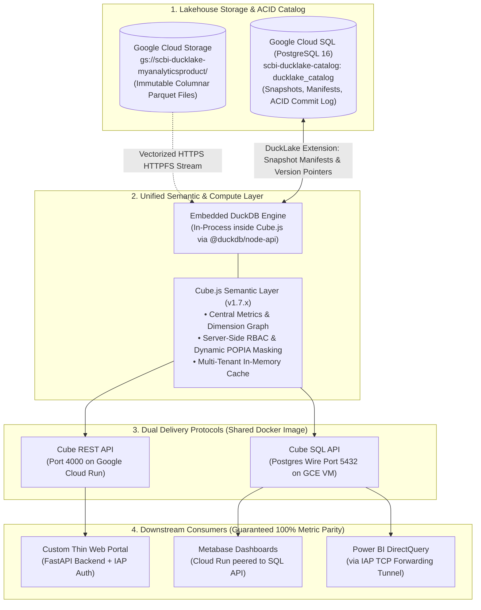

# Architecture Blueprint — Version 2.0: Unified ACID Lakehouse & Semantic Metric Layer

| | |
|---|---|
| **Document ID** | ARCH-V2-DUCKLAKE-CUBE |
| **Status** | Proposed (Gate 2 Checkpoint) |
| **Author** | Platform Architecture & Data Engineering |
| **Date** | 2026-09-25 |
| **PRD Reference** | [`docs/prd.md`](./prd.md) |
| **ADR References** | [`ADR-0001`](./adr/0001-ducklake-or-parquet.md), [`ADR-0002`](./adr/0002-outstanding-decisions.md), [`ADR-0003`](./adr/0003-access-model-and-role-roster.md), [`ADR-0004`](./adr/0004-dual-delivery-topologies.md) |

---

## 1. System Topology & Component Diagram



---

## 2. Component Design & Architectural Decisions

### 2.1 Storage & Catalog Architecture (DuckLake)
- **Primary Data Store**: Google Cloud Storage (`gs://scbi-ducklake-myanalyticsproduct/`) storing immutable Parquet files organized by marts (`scbi_cdp_mart/`, `scbi_sal_mart/`).
- **ACID Metadata Catalog**: Google Cloud SQL PostgreSQL 16 (`ducklake_catalog`).
- **Operational Invariant**: No reader ever queries GCS files directly via globbing patterns. Every read binds to the DuckLake catalog (`ATTACH 'ducklake:postgres:...' AS lake`), resolving queries against an atomic snapshot manifest pointer.
- **Torn Read Prevention**: Upstream batch reloads upload files to a staging prefix, register new manifests into PostgreSQL, and commit the new version atomically. Readers continue reading the pinned active snapshot until commit completion.

### 2.2 In-Process Analytics Engine (Embedded DuckDB)
- **Engine Placement**: DuckDB executes **strictly in-process** within the Node.js Cube process memory space via `@duckdb/node-api`.
- **No Standalone Daemon**: Eliminates network serialization hops, external container overhead, and daemon lifecycle management.
- **Extensions**: DuckDB dynamically loads `httpfs` (for authenticated GCS streaming) and `ducklake` (for PostgreSQL metadata parsing).

### 2.3 Semantic Metric Layer (Cube.js 1.7.x)
- **Single Source of Truth**: All downstream tools connect exclusively through Cube.js.
- **Cube Schemas**: Replaces fragmented hand-coded SQL with structured Cube definitions:
  - `AnnuityQuotation.js`
  - `InvestmentAnalysis.js`
  - `MemberAnalysis.js`
  - `SharedDimensions.js`
- **Dynamic POPIA Redaction**: Compile-time dimension masking redacts PII fields (`member_id`, `id_number`, `client_name`) into irreversible salted hashes unless the verified JWT security context asserts `canViewPii: true`.

### 2.4 Delivery Interfaces & Topologies (ADR-0004)
- **Single Artifact Principle**: Both delivery runtimes are deployed from the **identical Docker image** (`scbi-cube:2.0`), sharing the exact same cube schemas, security rules, and DuckDB configuration.
- **Cloud Run (REST API)**: Serverless, auto-scaling deployment on port 4000 for web app consumption. Authenticates incoming requests via signed HS256 JWTs.
- **Compute Engine VM (SQL API)**: Dedicated e2-standard-4 VM on port 5432 speaking PostgreSQL wire protocol. Required because Cloud Run does not support persistent TCP listeners or DirectQuery long-lived connections cleanly.
- **Security Boundary**: The SQL VM does not expose port 5432 to the public internet; connections are made via Google Cloud IAP TCP forwarding or internal VPC peering.

### 2.5 Downstream Consumer Architecture
1. **Thin Web Portal**: Decoupled FastAPI service running on Cloud Run. Validates Google IAP identity header (`X-Goog-Authenticated-User-Email`), maps user to `role_assignments.json`, mints short-lived HS256 Cube JWT, and queries Cube REST API.
2. **Metabase**: Cloud Run instance connected via internal VPC connector to `scbi-cube-sql:5432`.
3. **Power BI DirectQuery**: Analyst workstations connect to `localhost:5432` mapped through `gcloud compute start-iap-tunnel scbi-cube-sql 5432`.

---

## 3. Existing Component Audit & Component Inventory

### 3.1 Existing Component Audit
| Object / Artifact in Codebase | Current Responsibility | Audit Finding | Architectural Action |
|---|---|---|---|
| `cube/cube.js` | Cube 0.35 server config with globbed DuckDB views | Outdated version, lacks DuckLake support, hardcoded SQL views | **Decompose & Upgrade**: Migrate to Cube 1.7.x + `@duckdb/node-api` + DuckLake attach |
| `cube/model/cubes/*.js` | Dimension and measure definitions | Partially complete, inconsistent join graphs | **Extend**: Upgrade to Cube 1.7 syntax, add POPIA masking hooks and join hierarchies |
| `thin-web-app/server.py` | Monolithic HTTP server with mock fallback endpoints | Contains synthetic constants, client-asserted parameters | **Decompose**: Clean FastAPI router consuming Cube REST API via server-minted JWTs |
| `thin-web-app/app.js` | Frontend presentation dashboard | Well-designed frontend UI | **Reuse as-is**: Keep UI aesthetics; only rewire API routes to FastAPI gateway |
| `scripts/migrate_cube_data_to_parquet.py` | Data reload pipeline from Snowflake to GCS | Lacks atomic snapshot commit; leaves stale files | **Extend**: Add DuckLake snapshot commit step to commit atomically into PostgreSQL catalog |
| `scripts/sync_kanban.py` | Scope and ticket synchronizer | Standalone sync utility | **Reuse as-is**: Maintained in repo and active via lifecycle hook |

### 3.2 Component Inventory
| Component Name | Architectural Layer | Responsibility | Dependencies / Inputs | Action | Target Location |
|---|---|---|---|---|---|
| `ducklake-catalog-init` | Lakehouse Storage | Provisions schemas, commit logs, and snapshot tables | PostgreSQL 16 (`ducklake_catalog`) | New Build | `version-two/ducklake/init_catalog.py` |
| `atomic-reload-pipeline` | Ingestion / Ingest | Stage Snowflake data, upload Parquet, commit snapshot atomically | Snowflake, GCS, Cloud SQL | Extend | `version-two/ducklake/reload_pipeline.py` |
| `cube-semantic-engine` | Semantic / Compute | Executes Cube.js 1.7.x with embedded DuckDB and DuckLake attach | DuckLake catalog, GCS Parquet | Upgrade / New | `version-two/cube/cube.js` |
| `cube-security-context` | Security / Governance | Validates JWT, sets compile-time role allowlists and PII masking | Inbound JWT claims | New Build | `version-two/cube/security.js` |
| `semantic-domain-cubes` | Semantic Modeling | Defines measures, dimensions, and join graphs for all business marts | DuckLake tables (`lake.*`) | Extend | `version-two/cube/model/*.js` |
| `portal-api-gateway` | Presentation API | Authenticates IAP identity, mints Cube JWT, proxies frontend queries | Google IAP, `role_assignments.json` | Decompose / New | `version-two/portal/server.py` |
| `local-dev-harness` | Developer Experience | Spins up local PostgreSQL, mock credentials, and local Cube | Docker Compose, Local Node/Python | New Build | `version-two/infra/docker-compose.dev.yml` |
| `parity-recon-suite` | Verification & Testing | Validates 100% bit-identical metric output across REST and SQL API | Snowflake, Cube REST, Cube SQL | New Build | `version-two/tests/test_metric_parity.py` |
| `concurrency-acid-suite` | Verification & Testing | Proves zero torn reads during continuous concurrent reloads | DuckLake catalog, Cube server | New Build | `version-two/tests/test_concurrency_acid.py` |

---

## 4. Auth, Governance & POPIA Enforcement

```
[Browser / Client]
       │
       ▼  HTTPS
[Google Cloud IAP] (Validates enterprise SSO)
       │
       │ X-Goog-Authenticated-User-Email: user@company.com
       ▼
[Portal API Gateway]
       │
       ├─► [role_assignments.json] (Authoritative Role Roster)
       │        └─► Role: ROLE_ANNUITY_ANALYST, canViewPii: false
       │
       ├─► Mints HS256 JWT: { sub: user@..., role: 'ROLE_ANNUITY_ANALYST', canViewPii: false, exp: +1h }
       │
       ▼ Authorization: Bearer <JWT>
[Cube.js REST API]
       │
       ├─► queryRewrite(query, context):
       │     • Filters out cubes not in ROLE_PERMISSIONS[role].allowedCubes
       │     • Rewrites PII dimensions:
       │         canViewPii ? sql: `${CUBE}.id_number` : sql: `sha256(${CUBE}.id_number || 'salt')`
       │
       ▼
[In-Process DuckDB (Lakehouse Read)]
```

---

## 5. Environments & Deployment Architecture

| Tier | Component | Provisioning Spec | Access Method |
|---|---|---|---|
| **Prod** | Lakehouse Parquet Store | `gs://scbi-ducklake-myanalyticsproduct` | Uniform Bucket-Level Access, Workload Identity |
| **Prod** | Catalog Database | Cloud SQL PostgreSQL 16 (Private IP, 2 vCPU, 8GB RAM) | VPC Peering, SSL enforced |
| **Prod** | Cube REST API | Cloud Run Service (`scbi-cube`, 2 vCPU, 4GB RAM, min: 1, max: 10) | Serverless VPC Connector, HTTPS |
| **Prod** | Cube SQL API | Compute Engine VM (`scbi-cube-sql`, `e2-standard-4`, Debian 12, systemd) | Google Cloud IAP TCP Tunnel (Port 5432) |
| **Prod** | Web Portal | Cloud Run Service (`scbi-thin-web`, 1 vCPU, 2GB RAM) | Google Identity-Aware Proxy (HTTPS) |
| **Prod** | Metabase | Cloud Run Service (`scbi-metabase`) | VPC Peered to `scbi-cube-sql:5432` |
| **Dev** | Catalog Database | Docker Container (`postgres:16-alpine` on port 5433) | `localhost:5433` |
| **Dev** | Parquet Store | Remote GCS Bucket via ADC | `gcloud auth application-default login` |
| **Dev** | Cube Engine | Local Node.js (`node index.js` on port 4000) | `localhost:4000` |
| **Dev** | Web Portal | Local Uvicorn / FastAPI on port 8000 | `localhost:8000` |

---

## 6. Architecture Risk Pass

1. **Risk 1 (Cube.js 1.7.x `@duckdb/node-api` Native Driver Maturity)**:
   - *Impact*: Incompatibilities between `@duckdb/node-api` and DuckLake extension loading.
   - *Mitigation*: Fallback to standard `duckdb` npm package with DuckLake C-extension bindings if node-api driver exhibits instability.
2. **Risk 2 (In-Process DuckDB Memory Consumption under High Concurrency)**:
   - *Impact*: Memory spikes on Cube Node.js container causing OOM kills.
   - *Mitigation*: Configure DuckDB `max_memory` constraint (e.g. 70% of container limit) and leverage Cube pre-aggregations / query queueing.
3. **Risk 3 (Power BI DirectQuery Query Syntax Incompatibilities)**:
   - *Impact*: Power BI generates complex nested PostgreSQL dialect queries that Cube SQL API fails to transpile into semantic queries.
   - *Mitigation*: Establish strict DirectQuery schema views in Cube and validate against the Power BI automated dialect test suite in Epic 5.
