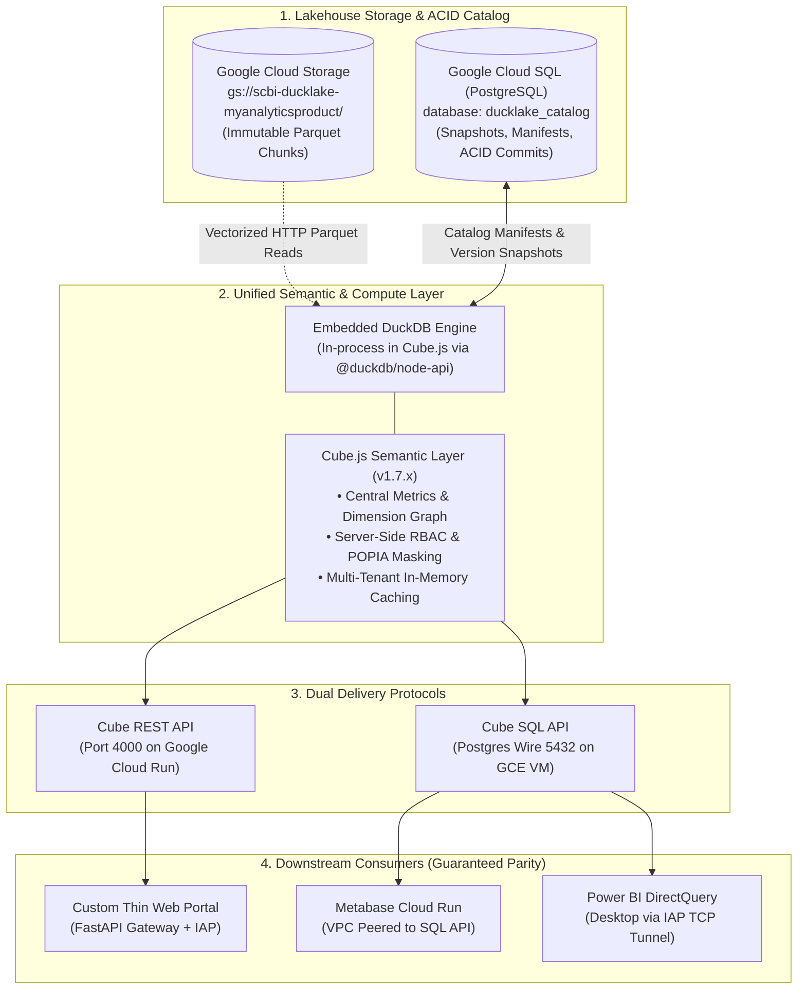

# PRD — Version 2.0: Unified ACID Lakehouse & Semantic Metric Layer (DuckLake + Cube.js)

| | |
|---|---|
| **Document ID** | PRD-V2-DUCKLAKE-CUBE |
| **Status** | Approved (Gate 1 Passed) |
| **Author** | SC BI Engineering & Platform Architecture |
| **Date** | 2026-09-25 |
| **Source Material** | [`docs/version-two-clarify.md`](./version-two-clarify.md), [`thin-web-app/PRD_ARCHITECTURE_REALIGNMENT.md`](../thin-web-app/PRD_ARCHITECTURE_REALIGNMENT.md), [`docs/adr/0001-ducklake-or-parquet.md`](./adr/0001-ducklake-or-parquet.md) |
| **Scope** | `version-two/` greenfield module, GCP project `myanalyticsproduct`, Cube.js 1.7.x semantic layer, Cloud SQL `ducklake_catalog`, GCS Lakehouse Parquet store |
| **Target Consumers** | Thin Web Portal (REST), Metabase (SQL API), Power BI DirectQuery (SQL API via IAP) |

---

## 1. Executive Summary

In **Version-Two (`version-two`)**, the enterprise data delivery architecture undergoes a foundational realignment: transitioning from an uncoordinated, raw "Parquet-on-GCS globbing" layout to a **true ACID Lakehouse powered by DuckLake**, with **Cube.js (v1.7.x) operating as the exclusive, single source of truth** for all business metrics, access governance, and downstream query execution.

Under this architecture, downstream consumption channels (**Power BI DirectQuery**, **Metabase Dashboards**, and the **Custom Thin Web App**) are physically and architecturally prohibited from querying Google Cloud Storage or the Cloud SQL PostgreSQL catalog directly. All analytical interactions terminate at the Cube.js semantic layer, ensuring 100% metric parity, deterministic snapshot isolation, and strict POPIA compliance across the entire organization.

DuckDB is embedded directly in-process within Cube.js via native bindings (`@duckdb/node-api`), avoiding distributed daemon overhead while providing high-performance vectorized columnar query execution. Dual delivery interfaces (REST on Cloud Run, Postgres Wire SQL API on Compute Engine VM) share the exact same container image, semantic schema, and security policies.

---

## 2. Problem Statement & Root Causes

### 2.1 The Core Problems in Legacy Architecture (V1)

1. **Absence of ACID Isolation & Risk of Torn Reads**:
   - The legacy implementation globbed raw Parquet files directly from GCS (`read_parquet('gs://.../*.parquet')`).
   - When batch reload pipelines run concurrently with business querying, readers experience torn reads—retrieving partial, mixed, or corrupted datasets mid-upload.
   - Snowflake `COPY INTO` chunking variations leave stale Parquet partitions in place, resulting in duplicate counts.

2. **Metric Fragmentation Across Reporting Silos**:
   - Power BI, Metabase, and the custom Web App previously utilized separate query paths, duplicated SQL calculations, and differing filter semantics.
   - Discrepancies between executive portal figures and analyst BI dashboards eroded organizational trust in core KPIs (e.g., Annuity Quotation totals, AUA, active member counts).

3. **Client-Asserted RBAC & POPIA Exposure**:
   - Previous web layers permitted client-side tampering of roles and PII masking via HTTP request parameters or UI toggles (`?role=...&maskPii=...`).
   - Member demographic data and personal identifiers risked unauthorized exposure under South Africa's Protection of Personal Information Act (POPIA).

4. **Hardcoded Demonstrators & Non-Failing Verification**:
   - Earlier portal endpoints substituted static constants and synthetic multipliers for missing semantic models, concealing underlying gaps.
   - Testing suites verified tautological identity assertions rather than comparing against independent, verifiable ground truth.

5. **Operational Divergence (Local Dev vs. Production)**:
   - Disconnected configurations forced engineers to test against ad-hoc scripts or unauthenticated local mocks that failed to replicate production GCS, Cloud SQL, and Cube behaviors.

---

## 3. Goals & Non-Goals

### 3.1 Business & Technical Goals

- **G1 (True ACID Lakehouse Catalog)**: Implement DuckLake with PostgreSQL (`ducklake_catalog`) as the metadata and snapshot catalog, eliminating torn reads and stale file accumulation via transactional commits and snapshot isolation.
- **G2 (Single Source of Semantic Truth)**: Standardize all downstream consumers (Thin Web App, Metabase, Power BI) onto Cube.js v1.7.x. Ensure zero direct consumer access to GCS or Cloud SQL.
- **G3 (Metric & Calculation Parity)**: Ensure that identical dimensions, measures, and filter cascades resolve to bit-identical numerical results across REST and SQL interfaces.
- **G4 (Server-Enforced RBAC & POPIA Masking)**: Enforce role resolution and cryptographic PII data masking inside Cube.js and the API gateway based on verified identity tokens (Google IAP / secure session), never browser parameters.
- **G5 (Dual Delivery Topologies from a Single Container)**: Provide dual delivery:
  - **REST / GraphQL API** (Port 4000) deployed on Google Cloud Run for web applications.
  - **PostgreSQL Wire SQL API** (Port 5432) deployed on Compute Engine VM (with IAP tunneling) for BI tools (Power BI, Metabase).
  - Both deployed from the exact same container image and semantic repository.
- **G6 (Reproducible Local Developer Stack)**: Provide a one-command local developer environment (`docker-compose.dev.yml` + Node + Python) mirroring production mechanics using local PostgreSQL and remote GCS streaming via Application Default Credentials (ADC).
- **G7 (Automated Parity & Concurrency Verification)**: Establish an automated test harness validating Snowflake vs. DuckLake vs. Cube numeric parity, POPIA boundary enforcement, and concurrent read consistency during reloads.

### 3.2 Non-Goals

- **NG1 (Snowflake/dbt Mart Restructuring)**: We do not alter upstream Snowflake data models or dbt pipelines in `dbt-scbi-cnf` / `dbt-scbi-sal`. We consume the existing 44 migrated mart tables.
- **NG2 (Standalone DuckDB Server / Daemon)**: DuckDB will NOT be deployed as an independent network service or container. DuckDB executes strictly in-process inside Cube.js.
- **NG3 (UI / Visual Redesign)**: The frontend visual aesthetics, CSS tokens, branding, and dashboard layouts of the portal remain preserved; only data-fetching, filter cascades, and authentication plumbing are realigned.
- **NG4 (Alternative BI Server Replacements)**: We do not replace Metabase or Power BI; we rewire their data sources to point exclusively at the Cube SQL API.
- **NG5 (In-Place Mutation of V1 Production before Validation)**: Work will be developed cleanly in `version-two/` and validated end-to-end prior to any cutover.

---

## 4. System Architecture & Topology

### 4.1 Topology Specifications

| Environment | Component | Hosting Runtime | Port & Protocol | Network / Security Boundary |
|---|---|---|---|---|
| **Prod** | Catalog Database | Google Cloud SQL (PostgreSQL 16) | 5432 (Internal) | VPC private IP, SSL required |
| **Prod** | Parquet Data Store | Google Cloud Storage | HTTPS (REST) | Uniform Bucket Level Access, Workload Identity |
| **Prod** | Cube REST API | Google Cloud Run (`scbi-cube`) | 4000 (HTTPS) | Serverless VPC Connector, Cloud IAM / Secret Manager |
| **Prod** | Cube SQL API | Compute Engine VM (`scbi-cube-sql`) | 5432 (TCP) | Internal VPC, Google Cloud IAP TCP Forwarding |
| **Prod** | Thin Web Portal | Google Cloud Run (`scbi-thin-web`) | 8000 / 443 | Google Identity-Aware Proxy (IAP) |
| **Prod** | Metabase | Google Cloud Run (`scbi-metabase`) | 3000 / 443 | VPC Connector to Cube SQL VM |
| **Local Dev** | Catalog Database | Docker (`postgres:16-alpine`) | 5433 (Localhost) | Local bridge network |
| **Local Dev** | Parquet Data Store | Remote GCS Bucket | HTTPS | `gcloud auth application-default login` |
| **Local Dev** | Cube.js Engine | Local Node.js (Embedded DuckDB) | 4000 (Localhost) | Local loopback |
| **Local Dev** | Thin Web App | Local Python/FastAPI | 8000 (Localhost) | Local loopback |

---

## 5. User Roles, Security & POPIA Governance

### 5.1 Identity & Role Propagation Invariant

The client browser never selects or transmits user roles or PII permissions.
1. The user authenticates through **Google Identity-Aware Proxy (IAP)**.
2. The Thin Web App backend extracts verified identity claims from the `X-Goog-Authenticated-User-Email` header.
3. The backend maps the email against the authoritative corporate role roster (ADR-0003).
4. The backend mints a signed HS256 Cube JWT containing the verified `role` and `canViewPii` claims.
5. Cube.js applies compile-time query filters, dimension masking, and cube allowlists according to the verified security context.

### 5.2 Role Roster Matrix

| Role Identifier | Description | Allowed Cubes | POPIA Masking Default |
|---|---|---|---|
| `ROLE_EXECUTIVE_ALL` | Executive leadership | All 12 cubes | Unmasked (Authorized) |
| `ROLE_INVESTMENT_ANALYST` | Portfolio & asset managers | `InvestmentAnalysis`, `SharedDimensions` | Masked |
| `ROLE_ANNUITY_ANALYST` | Actuarial & annuity operations | `AnnuityQuotation`, `SharedDimensions` | Masked |
| `ROLE_MEMBER_OPERATIONS` | Pension fund administrators | `MemberAnalysis`, `SharedDimensions` | Unmasked (Role-Authorized) |
| `ROLE_AUDIT_COMPLIANCE` | Risk & data privacy auditors | All cubes (read-only audit) | Masked |

---

## 6. Functional Epics & Work Breakdown

### Epic 1: DuckLake Catalog & Lakehouse Storage (`version-two/ducklake/`)
- Initialize PostgreSQL `ducklake_catalog` schemas, snapshot tracking tables, and commit logs.
- Provide standardized DuckDB `ATTACH 'ducklake:postgres:...' AS lake` configuration scripts.
- Develop atomic reload script (`reload_pipeline/`) performing stage upload, snapshot generation, and catalog commit with zero torn reads.
- Build snapshot audit and time-travel inspection utilities.

### Epic 2: Cube.js 1.7.x Unified Semantic Layer (`version-two/cube/`)
- Configure Cube.js 1.7.x with `@duckdb/node-api` native embedded driver.
- Implement central security context in `cube.js` parsing JWT tokens, enforcing role allowlists, and dynamically redacting PII columns (`member_id`, `id_number`, `client_name`).
- Build comprehensive semantic cube definitions covering all business domains:
  - `AnnuityQuotation.js`
  - `InvestmentAnalysis.js`
  - `MemberAnalysis.js`
  - `SharedDimensions.js`
- Create multi-table join graphs and reusable aggregate views.
- Provide `mint_sql_users.js` generating scrypt-hashed credentials for BI SQL access.

### Epic 3: Infrastructure & Dual Delivery Topologies (`version-two/infra/`)
- Author `docker-compose.dev.yml` spinning up local PostgreSQL catalog and development configurations.
- Create Cloud Run deployment manifests for Cube REST API (`scbi-cube`).
- Create Compute Engine VM deployment manifests (`systemd`, Cloud Ops, VPC peering, IAP) for Cube SQL API (`scbi-cube-sql`).
- Provision GCS bucket lifecycle rules, service account permissions, and Secret Manager bindings.

### Epic 4: Downstream Consumer Integration (`version-two/portal/`, `version-two/metabase/`)
- Build lightweight, decoupled Web Portal backend (`server.py`) consuming Cube REST API via generated JWTs.
- Preserve existing frontend UI dashboards, replacing synthetic endpoints with live, cascading Cube queries.
- Configure Metabase dashboards to query Cube SQL API over Postgres wire protocol.
- Document Power BI DirectQuery connection procedure over IAP TCP tunnel.

### Epic 5: Verification, Parity & Concurrency Testing (`version-two/tests/`)
- **Recon Parity Suite**: Cross-validate Cube metric results against direct Snowflake/DuckDB queries across random partition samples.
- **RBAC & POPIA Suite**: Automated penetration tests attempting role escalation and unmasked PII exfiltration without proper JWT claims.
- **Concurrency & ACID Suite**: Execute continuous read queries during an ongoing table reload to prove zero torn reads, zero deadlocks, and deterministic snapshot isolation.

---

## 7. Success Criteria & Verification Metrics

| Dimension | Legacy Baseline (V1) | Target Requirement (V2) | Verification Method |
|---|---|---|---|
| **ACID Lakehouse Isolation** | 0% (Raw Parquet globbing; torn reads on reload) | 100% (All reads through DuckLake snapshot catalog) | Concurrency test suite running during live data reload |
| **Metric Parity** | Divergent (Web App fabricated, BI direct SQL) | 100% Bit-Identical across REST, Metabase & Power BI | Automated reconciliation test suite across 100 sample queries |
| **Credential Safety** | Exposed plaintext in scripts/repos | 0 plaintext secrets; Secret Manager & IAM ADC only | Automated static security scanner (`detect-secrets` / regex sweep) |
| **RBAC Enforcement** | Client-asserted query parameter | Server-verified IAP claims & Cube JWT enforcement | Automated negative security test suite asserting 403 / masked fields |
| **Developer Spin-Up Time** | Complex, multi-step manual configuration | < 5 minutes via `docker-compose.dev.yml` & ADC | Clean checkout onboarding verification |
| **Dashboard Query Latency** | Synthetic (<10ms) / Real (>10s) | p95 < 2.5s for standard analytical views | Automated benchmark suite under 20 concurrent connections |

---

## 8. Gate 1 Review & Verification Checkpoint

Per rule `.agents/rules/de-workflow-gate.md`, Outer Loop Step 1 (**`de-idea-prd`**) requires explicit user verification before transitioning to Architecture & ADRs (**`de-architecture`**).

**Verification Points for Human Sign-off:**
1. **Problem Statement Validation**: Do the stated defects (torn reads on globbing, metric divergence across tools, client-side RBAC, and synthetic endpoints) accurately reflect the system problems to solve?
2. **Goals & Non-Goals Alignment**: Are the scope boundaries (e.g. keeping Snowflake/dbt marts untouched, keeping frontend styling unchanged, building in `version-two/`) approved?
3. **Architecture Direction**: Is the choice of DuckLake + embedded DuckDB in Cube.js with dual delivery (REST on Cloud Run, SQL on GCE VM) aligned with organizational platform goals?
