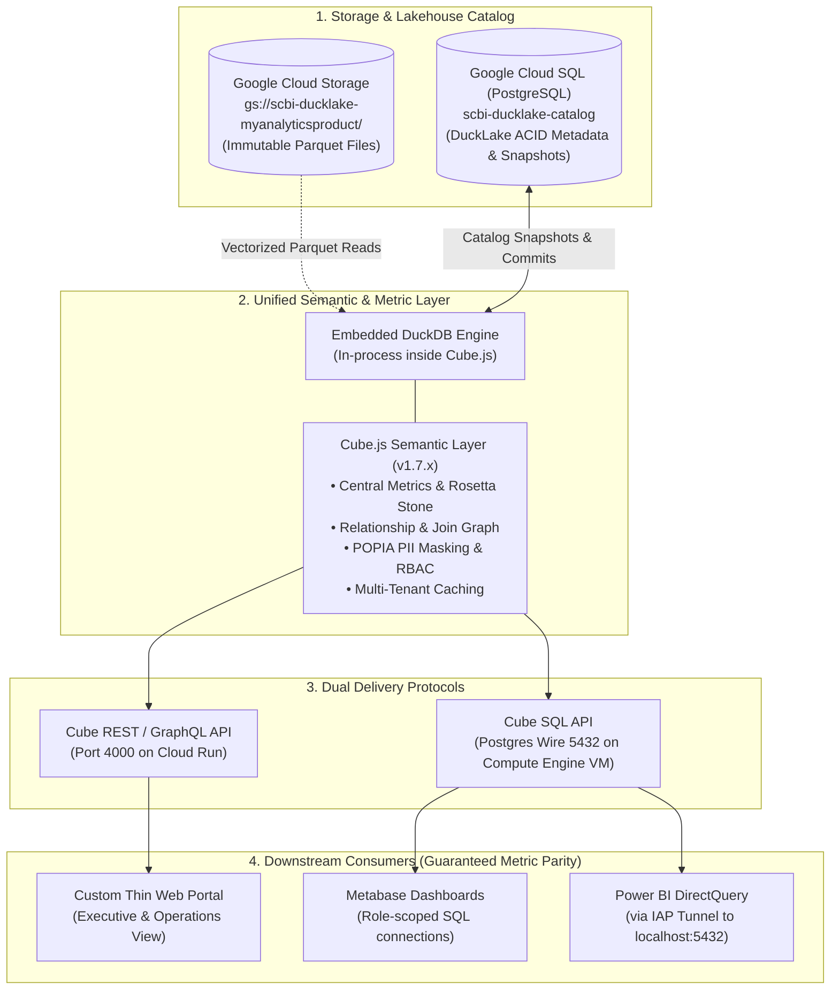
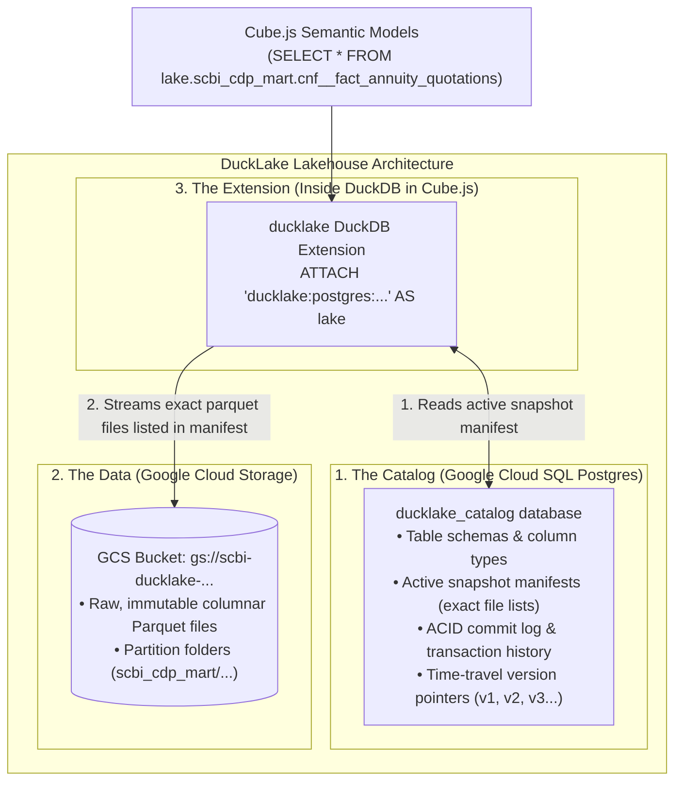
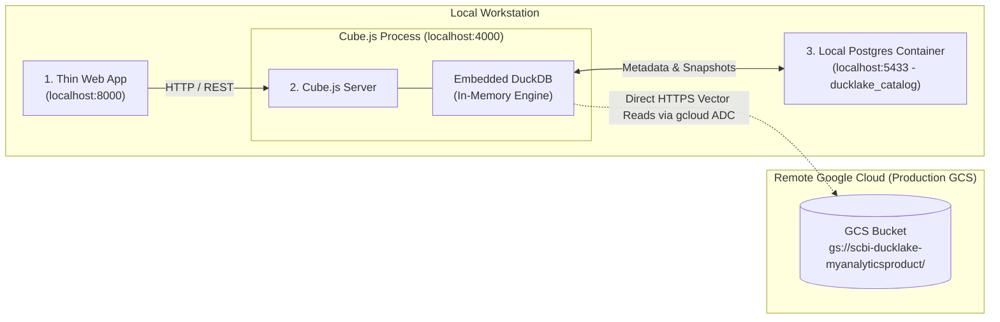
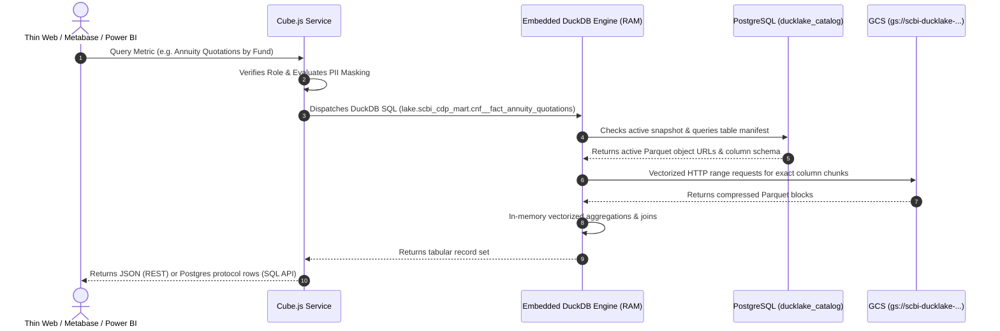

# Architecture & Topology Clarification: Version-Two (`version-two-clarify.md`)

---

## 1. Executive Summary

In **`version-two`**, the data architecture transitions from an uncoordinated "Parquet-on-GCS glob" setup to a **true ACID Lakehouse powered by DuckLake**, with **Cube.js as the single source of truth** for all metrics, security rules, and downstream consumption.

Downstream tools (**Power BI**, **Metabase**, and the **Thin Web App**) never query Google Cloud Storage or PostgreSQL directly. All analytical queries pass through Cube.js to guarantee identical metrics across the enterprise.



---

## 2. Where Does DuckDB Live in the Architecture?

**DuckDB does NOT live as a standalone server, external container, or separate VM.**

Like SQLite, **DuckDB is an in-process, embedded columnar analytics engine**. 
* In both **local development** and **production**, DuckDB lives **directly inside the Cube.js process memory space** (`node` / `cubejs-server`), loaded via the `@duckdb/node-api` native binding.
* There is no DuckDB daemon or port to manage. When Cube starts, it initializes an in-memory DuckDB instance, loads extensions (`httpfs`, `ducklake`), and executes queries directly in RAM.

---

## 3. How Does DuckLake Fit in the Design?

**DuckLake is the ACID Lakehouse format and catalog specification for DuckDB.** It acts as the **bridge** between three components:
1. **The Data Storage**: The compressed, immutable Parquet files in **Google Cloud Storage (GCS)**.
2. **The ACID Catalog**: The PostgreSQL database in **Google Cloud SQL** (`ducklake_catalog`).
3. **The Compute Engine**: **DuckDB** embedded inside Cube.js.



### The Critical Problems DuckLake Solves:
* **Eliminates Torn Reads**: When data reload pipelines upload fresh Parquet files, readers querying the portal do not see half-uploaded data. Live queries pin snapshot `v4` until snapshot `v5` commits atomically in Cloud SQL.
* **Eliminates Stale-File Double Counting**: In raw Parquet globbing (`read_parquet('.../*.parquet')`), old files that Snowflake did not overwrite remain in the bucket and are accidentally read twice. DuckLake only reads the exact files registered in the snapshot manifest.
* **Enables Time Travel**: Audit and compare figures at any historical version (`SELECT ... AT (VERSION => 2)`).

---

## 4. Local Development vs. Production Topology

```
┌────────────────────────────────────────────────────────────────────────────────────────┐
│                                 LOCAL DEVELOPMENT                                      │
├────────────────────────────────┬───────────────────────────────┬───────────────────────┤
│ Component                      │ Where It Runs                 │ How to Spin It Up     │
├────────────────────────────────┼───────────────────────────────┼───────────────────────┤
│ 1. PostgreSQL (Catalog)        │ Local Docker Container (5433) │ docker run postgres   │
│ 2. DuckDB Engine               │ In-process inside Cube.js     │ Automatically loaded  │
│ 3. Cube.js Server              │ Local Node.js process (4000)  │ npm run dev (in cube/)│
│ 4. Thin Web App                │ Local Python / Static (8000)  │ python server.py      │
│ 5. Data Files (Parquet)        │ Remote in Google Cloud GCS    │ GCS via your gcloud   │
│                                │                               │ user credentials/ADC  │
└────────────────────────────────┴───────────────────────────────┴───────────────────────┘

┌────────────────────────────────────────────────────────────────────────────────────────┐
│                                    PRODUCTION                                          │
├────────────────────────────────┬───────────────────────────────┬───────────────────────┤
│ Component                      │ Where It Runs                 │ Infrastructure        │
├────────────────────────────────┼───────────────────────────────┼───────────────────────┤
│ 1. PostgreSQL (Catalog)        │ Google Cloud SQL              │ scbi-ducklake-catalog │
│ 2. DuckDB Engine               │ In-process inside Cube.js     │ Embedded in container │
│ 3. Cube.js (REST API)          │ Google Cloud Run (port 4000)  │ scbi-cube             │
│    Cube.js (SQL API)           │ Compute Engine VM (port 5432) │ scbi-cube-sql         │
│ 4. Thin Web App                │ Google Cloud Run              │ scbi-thin-web + IAP   │
│ 5. Data Files (Parquet)        │ Google Cloud Storage          │ gs://scbi-ducklake... │
└────────────────────────────────┴───────────────────────────────┴───────────────────────┘
```

---

## 5. Local Developer Workflow (Spinning Up Locally)

Because DuckDB runs embedded in Cube and Parquet files stay in GCS, you only need to run **3 local components**:



### Spin-Up Commands:

1. **Spin up Local Catalog Database (PostgreSQL)**:
   ```bash
   docker run --name local-ducklake-catalog \
     -e POSTGRES_PASSWORD=devpass \
     -e POSTGRES_DB=ducklake_catalog \
     -p 5433:5432 -d postgres:16-alpine
   ```

2. **Authenticate with GCS on Developer Machine**:
   ```bash
   gcloud auth application-default login
   ```

3. **Spin up Cube.js (with Embedded DuckDB)**:
   ```bash
   cd version-two/cube
   npm install
   npm run dev
   ```
   *(Cube loads DuckDB, attaches local Postgres at port 5433, and streams Parquet directly from GCS).*

4. **Spin up Thin Web App**:
   ```bash
   cd version-two/portal
   python server.py
   ```
   *(App runs on `http://localhost:8000` connecting to Cube on `http://localhost:4000`).*

---

## 6. End-to-End Query Lifecycle



---

## 7. Dual Delivery Protocols: Why Cube Runs Two Services in Prod

Cloud Run cannot route the PostgreSQL wire protocol (TCP port 5432); it only routes HTTP/1, HTTP/2, gRPC, and WebSockets. Therefore:

| Service | Runtime | Port & Protocol | Target Clients |
|---|---|---|---|
| **`scbi-cube` (REST)** | Cloud Run | Port 4000 (HTTPS) | Custom Thin Web Portal, Telemetry Engine |
| **`scbi-cube-sql` (SQL API)** | Compute Engine VM | Port 5432 (Postgres Wire) | Metabase (via VPC), Power BI Desktop (via IAP tunnel) |

Both run from the **exact same container image**, ensuring that security rules, joins, and measures are 100% identical.

---

## 8. Planned `version-two/` Project Structure

```text
version-two/
├── README.md                           # Quickstart, architecture overview, operational runbooks
├── ducklake/                           # Lakehouse catalog & storage management
│   ├── init_catalog.sql                # PostgreSQL schema initialization (ducklake_catalog)
│   ├── attach_ducklake.sql             # Standard DuckDB ATTACH script
│   ├── reload_pipeline/                # Multi-table reload scripts writing through DuckLake
│   └── snapshots/                      # Snapshot audit, verification, and time-travel utilities
│
├── cube/                               # Cube.js 1.7.x semantic layer
│   ├── package.json                    # Pinned Cube 1.7.x dependencies (@duckdb/node-api 1.5.5)
│   ├── cube.js                         # Security context, DuckLake driver factory, RBAC & PII masking
│   ├── Dockerfile                      # Production container image for REST and SQL VM
│   ├── mint_sql_users.js               # Scrypt credential generator for per-role BI connections
│   ├── model/
│   │   ├── cubes/                      # Semantic cubes (Annuity, Investment, Member, Demographics)
│   │   │   ├── AnnuityQuotation.js
│   │   │   ├── InvestmentAnalysis.js
│   │   │   ├── MemberAnalysis.js
│   │   │   └── SharedDimensions.js
│   │   └── views/                      # Rollup and domain-specific semantic views
│   └── deploy/
│       ├── deploy_cube_rest_cloudrun.sh # Deploy REST API to Cloud Run
│       └── deploy_cube_sql_vm.sh        # Deploy SQL API to GCE VM with IAP & systemd
│
├── infra/                              # Infrastructure as Code (GCP & Docker)
│   ├── docker-compose.dev.yml          # One-command local dev stack (Local Postgres + Cube + Portal)
│   ├── cloud_sql/                      # Cloud SQL (Postgres) scbi-ducklake-catalog provisioning
│   └── storage/                        # GCS bucket lifecycle, retention & access policies
│
├── metabase/                           # Metabase BI configuration
│   ├── deploy_metabase.sh              # Metabase Cloud Run deployment with VPC Access
│   └── dashboards/                     # Declarative Metabase question/card definitions
│
├── portal/                             # Modern, lightweight Web Portal (consuming Cube REST)
│   ├── server.py                       # Python/FastAPI gateway with Google IAP authentication
│   └── static/                         # Dashboard UI (KPI cards, matrices, charts)
│
├── tests/                              # Comprehensive test & parity suite
│   ├── recon_parity/                   # Parity tests (Snowflake vs DuckLake vs Cube measures)
│   ├── rbac_security/                  # POPIA PII masking & cube permission boundary tests
│   └── concurrency/                    # Concurrency smoke test (reads during atomic reloads)
│
└── docs/                               # Up-to-date documentation
    ├── ARCHITECTURE.md                 # System architecture and data flow specifications
    ├── ADAPTED_ADRS.md                 # Consolidated ADR decisions (DuckLake adoption, Cube 1.7)
    └── USER_MANUAL.md                  # Analyst connection guide (Power BI IAP, Metabase logins)
```
